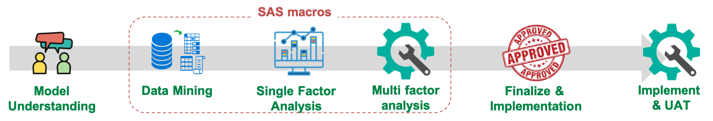

.. _intro-overview:

==========
Giới thiệu
==========

Tổng quan
=========
Mô hình chấm điểm rủi ro tín dụng (Credit Risk Scoring, Credit risk scorecard) là công cụ được sử dụng từ rất lâu trong ngân hàng nhằm mục đích phân loại khác hàng tốt hay xấu. Ví dụ một  thẻ điểm hay được sử dụng là FICO score. Các ngân hàng cũng xây thẻ điểm tín dụng cho riêng ngân hàng mình. Với các khách hàng có điểm tín dụng cao, khách hàng sẽ được chấp nhận cấp khoản vay. Đối với các khác hàng có điểm tín dụng thấp, khách hàng sẽ bị từ chối cấp khoản vay.
Bảng sau đây minh hoa cho một một thẻ điểm tín dụng:

.. list-table:: Credit Scorecard
   :widths: 25 50 10
   :header-rows: 1
   
   * - Attribute
     - Range
     - Score
   * - Age
     - Age < 25
     - 17
   * - 
     - 25 <= Age < 30
     - 20
   * - 
     - 30 <= Age < 35
     - 25
   * - 
     - 35 <= Age < 40
     - 31
   * - 
     - 40 <= Age
     - 33
   * - Income
     - Income < 5,000,000
     - 30
   * - 
     - 5,000,000 <= Income < 10,000,000
     - 5
   * - 
     - 10,000,000 <= Income < 20,000,000
     - 20
   * - 
     - 20,000,000 <= Income < 35,000,000
     - 40
   * - 
     - 35,000,000 <= Income
     - 60   
   * - Gender
     - Male
     - 25
   * - 
     - Female
     - 30
     
Ví dụ một khách hàng có thông tin như sau:

- Age: 35
- Income: 40,000,000
- Gender: Male

Thì tổng điểm tín dụng của khách hàng là :math:`31+60+25=116` điểm. Giả sử chính sách của ngân hàng chỉ cho vay với khách hàng có 100 điểm trở lên thì khách hàng trong ví dụ sẽ được chấp nhận cấp khoản vay. 

Cấu trúc của thẻ điểm tín dụng như sau:  Điểm tín dụng của khác hàng là tổng điểm của các yếu tố. Trong từng yếu tố lại chia ra thành các nhóm nhỏ (attribute). Cấu trúc này rất dễ hiểu và dễ sử dụng đối với đơn vị kinh doanh. Ví dụ từ bảng minh họa ta thấy:

- Với yếu tố tuổi, tuổi càng cao thì khách hàng có điểm tín dụng càng tốt.
- Khi so sánh giữa yếu tố tuổi và thu nhập. Có thể thấy rằng thu nhập có ảnh hưởng nhiều hơn tới điểm tín dụng của khách hàng.

Quy trình xây dựng Credit Scoring
=================================

Quy trình xây dựng thẻ điểm tín dụng thường bao gồm các bước sau đây:

   
Với giới hạn của tài liệu, ta chỉ xét đến các bước có sử dụng công cụ SAS:

- **Data Mining:** Là công đoạn tạo ra các biến có ý nghĩa từ dữ liệu thô. Khởi đầu, Macro  `Data Aggregation <https://smcs.readthedocs.io/vi/latest/post/DataAggregation.html>`_ để tạo các biến cho mô hình. Tiếp đó ta dùng Macro `Data Reduce <https://smcs.readthedocs.io/vi/latest/post/DataReduceSize.html>`_ để giảm kích thước của dữ liệu. Sau cùng ta dùng Macro `Data Partition <https://smcs.readthedocs.io/vi/latest/post/DataPartition.html>`_ để chia dữ liệu thành hai tập train và validate

- **Variable Analysis:** Sau khi có các biến, ta tiến hành phân tích biến. Macro `Variable Review <https://smcs.readthedocs.io/vi/latest/post/VariableReview.html>`_ được sử dụng để tính toán các chỉ số thống kê (min, max, mean, ...) để ta có cái nhìn về chất lượng dữ liệu. Tiếp đó ta tiến hành phân tích đơn biến với Macro `Variable Analysis <https://smcs.readthedocs.io/vi/latest/post/VariableAnalysis.html>`_. Để phân tích sự liên quan giữa các biến và tìm cách kết hợp biến, ta sử dụng các công cụ macro `Variable Interaction <https://smcs.readthedocs.io/vi/latest/post/VariableInteaction.html>`_. Sau khi phân tích xong các biến, ta sử dụng Macro `Data Transformation <https://smcs.readthedocs.io/vi/latest/post/DataTransformartion.html>`_ để chuyển các biến về định dạng WOE.

- **Variable Selection:** Là công đoạn chọn các biến vào mô hình. SMCS cung cấp một số phương pháp lựa chọn biến như sau:
   - *Stepwise method* sử dụng công cụ `Variable Selection: Stepwise Method <https://smcs.readthedocs.io/vi/latest/post/SelectFoward.html>`_.
   - *Marginal IV method* sử dụng công cụ `Variable Selection: Marginal IV Method <https://smcs.readthedocs.io/vi/latest/post/SelectMarIV.html>`_.

- **Model Assessment:** Sau khi đã chọn được bộ biến thích hợp, ta tiến hành đánh giá mô hình. Hai chỉ tiêu đánh giá chính của mô hình là 
   - *Tính phân biệt* sử dụng macro `Model Assessment: Discriminatory <https://smcs.readthedocs.io/vi/latest/post/ModelAssess.html>`_.
   - *Tính chính xác* sử dụng macro `Model Assessment: Accuracy <https://smcs.readthedocs.io/vi/latest/post/ModelAssess.html>`_.
  Với một số trường hợp, ta có thể sử dụng thêm phương pháp Cross Validate hoặc K-Fold Validation để đánh giá mô hình. SMCS cung cấp macro `Model Assessment <https://smcs.readthedocs.io/vi/latest/post/ModelCrossValidation.html>`_ để thực hiện việc này.

- **Reporting:** Sau khi có được mô hình cuối cùng, ta trình bày kết quả của mô hình. Macro `Report Variables <https://smcs.readthedocs.io/vi/latest/post/ReportVariable.html>`_ sẽ trình bày các biến và cách nhóm. Macro `Report Scorecard <https://smcs.readthedocs.io/vi/latest/post/ReportScorecard.html>`_ sẽ trình bày kết của của mô hình dưới dạng Scorecard. 

- **Monitoring:** Mô hình sau khi triển khai sẽ được hậu kiểm định kỳ. Các nội dung chính bao gồm:
   - Tính ổn định của mô hình bằng cách sử dụng macro `Monitoring Report Stability <https://smcs.readthedocs.io/vi/latest/post/MoniStability.html>`_.
   - Tính phân biệt của mô hình bằng cách sử dụng macro `Monitoring Report Discriminatory <https://smcs.readthedocs.io/vi/latest/post/MoniDiscriminatory.html>`_.
   - Tính chính xác của mô hình bằng cách sử sụng macro `Monitoring Report Accuracy <https://smcs.readthedocs.io/vi/latest/post/MoniAccuracy.html>`_.
