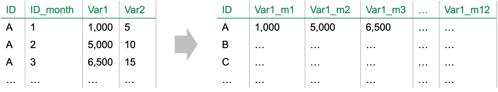

.. _post-data_aggregation:

================
Data Aggregation
================

Dữ liệu SQL
===========

Khi xây dựng Credit Scoring, ta thường sử dụng công cụ SQL để tạo các biến. Dữ liệu thường được lấy theo cách sau đây để tăng tính hiệu quả:

Các biến sẽ được lấy tại từng khung thời gian (theo tháng, tuần, năm) trước ngày quan sát. Ví dụ về dữ liệu được cho như sau:

  
Trong đó:

- ID là key của dữ liệu. Ví dụ customer\_id.
- ID\_month là số chỉ các frame. Ví dụ ID_month=3 nghĩa là thông tin được lấy tại tháng thứ 3 trước ngày quan sát.
- Var là các biến được lấy tại khoảng thời gian ID\_month tương ứng.

Từ dữ liệu này, ta tính các hàm tổng hợp:

- Num,Sum, Min, max, avg, std: Số lượng, tổng, giá trị nhỏ nhất, giá trị lớn nhất, giá trị trung bình, độ lệch chuẩn.
- Rng (range): giá trị lớn nhất – giá trị nhỏ nhất.
- Crr (Correlation): tương quan giữa biến và time step.
- Slp (Slope): hệ số góc giữa biến và time step.

Kết quả của Data Aggregation là các biến mới được đặt tên theo quy tắc như sau:

``Varname_agg1_agg2_c/m(i)``

Trong đó:

- Varname là tên của biến:
- Agg1, agg2 là các hàm aggregation dữ liệu, đặt tên theo 3 ký tự (num, min, avg, max, sum, std (standard deviation), crr (correlation), slp (slope), rng(range)). Agg1 được lấy từ từng snapshot, agg2 được lấy theo cumulative.
- c/m(i): c(i) là trong i tháng trước ngày quan sát (cumulative), m(i) là trong tháng I trước ngày quan sát (marginal).

**Ví dụ:** DPD_max_max_c12: Giá trị DPD lớn nhất của các giá trị lớn nhất trong vòng 12 tháng trước ngày quan sát. Có thể hiểu đơn giản là DPD lớn nhất trong 12 tháng trước ngày quan sát. Chú ý rằng có thể có những biến vô nghĩa (ví dụ DPD_max_min_12m). Cần lưu ý điều này khi phân tích biến. Minh họa về dữ liệu sau bước Data Aggregation được cho như sau:

Sử dụng Macro
=============

Syntax
------

Để thực hiện Data Aggregation, ta sử dụng Macro DATA_AGGREGATION. Cú pháp của Macro như sau:

.. code:: sh
  
  %Data_Aggregation (Dsin, Dsout, max_month, id, varlist)
  
Trong đó:

- **Dsin:** data đầu vào chính là data dạng multiple từ SQL.
- **Dsout:** data đầu ra. Mỗi biến cơ sở sẽ tạo ra :math:`max\_month\times 10`  biến mới.
- **Max_month:** Là số tháng lớn nhất trước ngày quan sát (12,6) của cột id_month.
- **Id:** Primary key của bảng. Ví dụ business_date customer_id.
- **Varlist:** Danh sách các biến.

Detail
------

Các bước xử lý trong macro như sau:

- Bước 1. Chuyển từ dạng bảng dọc sang dạng bảng ngang: Data từ dạng 

  
- Bước 2: Sử dụng `data step <https://documentation.sas.com/?docsetId=lestmtsref&docsetTarget=n1kh25to5o0wmvn1o4n4hsl3yyww.htm&docsetVersion=9.4&locale=en>`_ và  `array<https://documentation.sas.com/?docsetId=lestmtsref&docsetTarget=p08do6szetrxe2n136ush727sbuo.htm&docsetVersion=9.4&locale=en>`_ để tạo các biến mới với các hàm aggregate: num, min, avg, max, sum, std (standard deviation), crr (correlation), slp (slope), rng(range).

Output
------

Kết quả của macro là dữ liệu **Dsout** với các biến **Id** và các biến có dạng Varname_agg1_agg2_c/m(i)

Example
-------

Ví dụ dữ liệu đầu vào là VARIABLE_SQL với các biến Z1-Z3 và dữ liệu đầu ra mong muốn là VARIABLE.

.. code:: sh

  %DATA_AGGREGATION(DSIN=VARIABLE_SQL, 
                    DSOUT=VARIABLE, 
                    MAX_MONTH=12, 
                    ID=ID, 
                    VARLIST= Z1 Z2 Z3);
