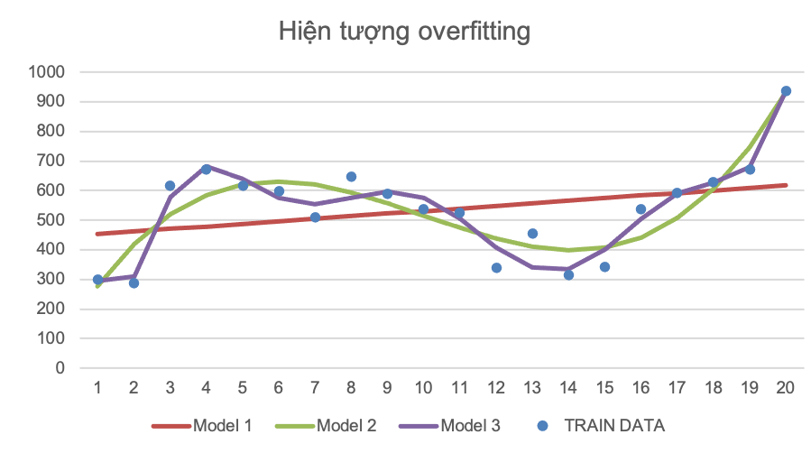
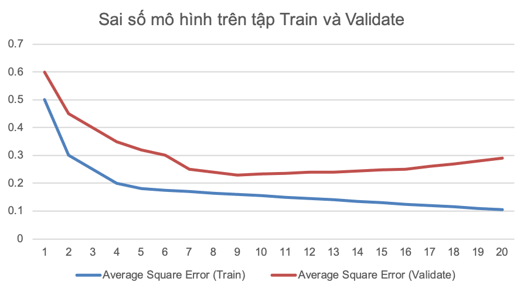
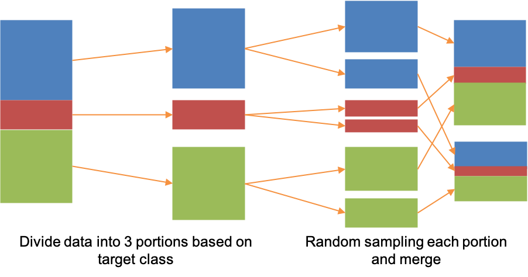

.. _post-data_partition:

===============
Data Partition
===============

Overfitting
===========

**Overfitting** là hiện tượng mô hình quá khớp với dữ liệu training. Việc quá khớp chỉ với một dữ liệu dẫn đến việc dự đoán nhầm, nhiễu và mô hình không còn tốt trên các dữ liệu khác. Hình sau đây minh họa hiện tượng overfitting.

Từ hình minh họa, ta thấy rằng:

- Mô hình 1: Quá đơn giản và quá yếu.
- Mô hình 2: Cân bằng giữa độ phức tạp và sức mạnh.
- Mô hình 3: Quá mạnh nhưng độ phức tạp cao, đồng thời không tốt trên mẫu test.

Tránh overfitting
=================

Để tránh overfittling, ta thường sử dụng quy trình như sau:

- Dữ liệu ban đầu thường được chia thành tập train và validate (out-of sampe).
- Xây dựng mô hình theo độ phức tạp tăng dần trên mẫu train, dùng mô hình này để score cho mẫu validate. 
- Theo dõi performance đồng thời trên dữ liệu train và validate.
- Chọn điều kiện dừng phù hợp (early stopping): thường là khi performance của model trên dữ liệu validate bắt đầu xấu đi.

Hình sau đây minh họa phương pháp tránh overfitting:

Với hình minh họa trên, ta thấy rằng, khi độ phức tạp của mô hình tăng dần thì sai số trên dữ liệu train giảm dần.Trong khi đó sai số trên dữ liệu validate lúc đầu giảm dần nhưng sau đó lại tăng lên. Căn cứ vào đồ thị, ta thấy dừng tại bước số 9 là hợp lý. 

Nếu số lượng quan sát trong dữ liệu đủ lớn, ta có thể chia dữ liệu ban đầu thành dữ liệu train (chiếm 70% quan sát) và dữ liệu validate (chiếm 30%) quan sát. Tỉ lệ này có thể là 70/30 hoặc 80/20. Khi chia dữ liệu thành hai phần cần chú ý các vấn đề như sau:

- Sử dụng kỹ thuật Stratify sample cho biến target (good/bad) nhằm đảm bảo tỉ lệ Good/Bad của mẫu validation và train là tương tự nhau.

- Sử dụng seed là giá trị định danh nhằm đảm bảo cách chia train/validate là tương tự nhau trong mỗi lần chia (mỗi lần chạy code).

Minh họa cho `stratify sampling <https://en.wikipedia.org/wiki/Stratified_sampling>`_ được minh họa như sau:

   

Sử dụng Macro
=============
Syntax
------

Để chia dữ liệu thành tập dữ liệu train và validate theo `stratify sampling <https://en.wikipedia.org/wiki/Stratified_sampling>`_, ta dùng Macro **DataPartition**. Tham số của Macro như sau:

.. code:: sh

   %DATAPARTITION (DATA, TRAIN, VALID, PERCENT, TARGET)

Trong đó:

- **DATA (data)**: Dữ liệu ban đầu cần chia (input).
- **TRAIN (data)**: Dữ liệu train (output).
- **VALID (data)**: Dữ liệu validate (output).
- **PERCENT (float)**: (Số quan sát dữ liệu train)/ (Số quan sát dữ liệu validate) *100.
- **TARGET (variable)**: Thực hiện stratify sampling dựa trên biến TARGET. Biến TARGET có thể là binary hoặc interval và phải nằm trong dữ liệu DATA

Detail
------

Các bước xử lý trong macro như sau:

- **Bước 1**: Check số lượng n các giá trị phân biệt của biến **TARGET**. Nếu n nhỏ hơn hoặc bảng 20 thì chuyển sang bước 2. Còn lại chuyển sang bước 3.
- **Bước 2**: Sử dụng `PROC HPSAMPLE <https://documentation.sas.com/?cdcId=pgmsascdc&cdcVersion=9.4_3.5&docsetId=prochp&docsetTarget=prochp_hpsample_syntax01.htm&locale=en>`_ để chia dữ liệu **DATA**  thành hai dữ liệu **TRAIN**  và  **VALID** theo tỉ lệ **PERCENT: (100- PERCENT)**.
- **Bước 3**: Chia biến **TARGET** thành 20 nhóm theo quantile. Sử dụng biến group mới này để thực hiện `stratify sampling <https://en.wikipedia.org/wiki/Stratified_sampling>`_. Sử dụng `PROC HPSAMPLE <https://documentation.sas.com/?cdcId=pgmsascdc&cdcVersion=9.4_3.5&docsetId=prochp&docsetTarget=prochp_hpsample_syntax01.htm&locale=en>`_ để chia dữ liệu **DATA** thành hai dữ liệu **TRAIN**  và  **VALID** theo tỉ lệ **PERCENT: (100- PERCENT)**.

.. code:: sh

   %DATAPARTITION (DATA.IMPORT, DATA.TRAIN, DATA.VALID, 70, Y);

