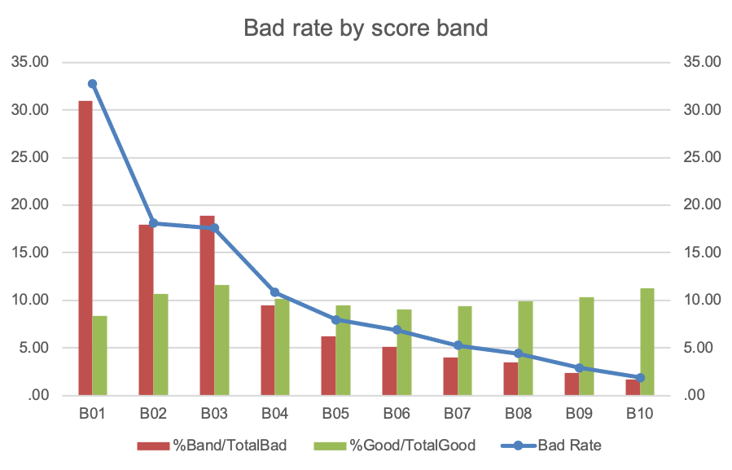
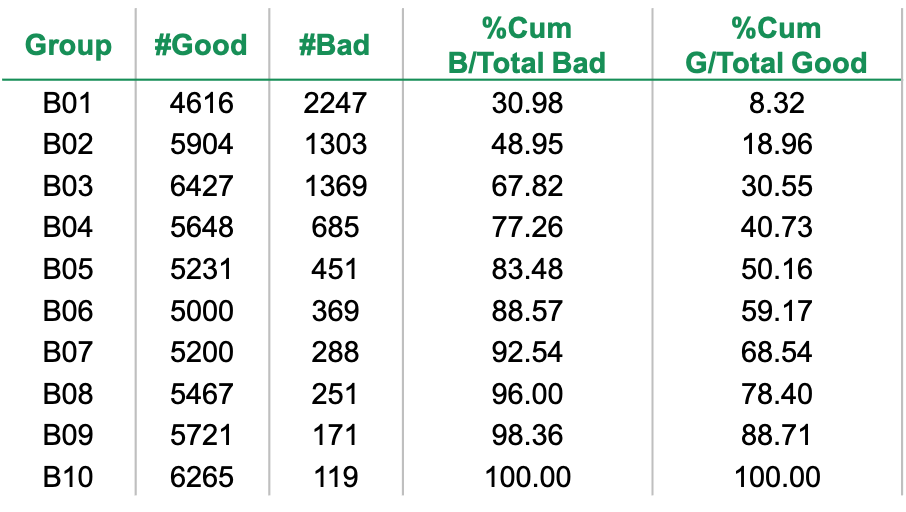
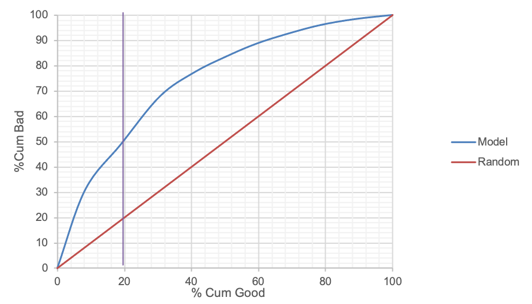

.. _post-model_assess-disc:

================================
Model Assessment: Discriminatory
================================

Kiểm định tính phân biệt
========================

Kiểm định tính phân biệt được sử dụng ở hầu hết các mô hình dự báo. Một mô hình là tốt nếu quan sát A "xấu" hơn quan sát B thì mô hình phải dự báo được rằng A "xấu" hơn B. Mục đích của kiểm định tính phân biệt là kiểm tra điều này. Một số kiểm định sau đây thường được áp dụng để kiếm tra tính phân biệt của mô hình.

Đánh giá thứ tự bad rate 
------------------------

Kiểm định này thường được thực hiện như sau:

- Chia các dữ liệu thành các nhóm dựa trên kết quả đầu ra của mô hình. Cách chia thường dùng là đảm bảo số quan sát ở mỗi nhóm bằng nhau (`quatile binning <https://documentation.sas.com/?cdcId=pgmsascdc&cdcVersion=9.4_3.5&docsetId=prochp&docsetTarget=prochp_hpbin_overview03.htm&locale=en>`_).
- Sắp xếp theo thứ tự các nhóm từ xấu đến tốt theo kết quả đầu ra và tính số lượng good, bad trong mỗi nhóm. Từ đó tính được bad rate của mỗi nhóm.
- Vẽ đồ thị thể hiện Bad rate trong từng nhóm.

Ví dụ được cho trong hình sau:

Đường cong ROC và hệ số Gini 
----------------------------

Từ kết quả tính toán good và bad trong mỗi nhóm, ta tính toán tỷ lệ luỹ kế good (%Cum Good) và tỷ lệ luỹ kế bad (%Cum Bad). Minh hoạ được cho ở bảng sau:

Đường cong roc (`Receiver operating characteristic <https://en.wikipedia.org/wiki/Receiver_operating_characteristic>`_) được tạo bởi hai cột, cột x là %Cum Good và cột y là %Cum Bad. 

Hệ số Gini được tính là hai lần phần diện tích được giới hạn bởi Roc curve của model và đường chéo nối điểm :math:`(0;0)` và :math:`(1;1)`.  Hệ số Gini nằm trong khoảng giá trị :math:`[−1;1]`. Nhìn chung, hệ số Gini càng lớn thì mô hình càng tốt. Một hệ số khác tương tự hệ số Gini là Sommers'D được tính như sau:

.. math::
  Sommers'D=\frac{n_c-n_d}{t}
  
Trong đó:

- :math:`n_c` (số lượng concordant) là số lượng các cặp :math:`(\widehat{y_i}, y_i)` và :math:`(\widehat{y_j}, y_j)` mà :math:`\widehat{y_i}> \widehat{y_j}` và :math:`y_i>y_j` hoặc :math:`\widehat{y_i}< \widehat{y_j}` và :math:`y_i<y_j`.
- :math:`n_d` (số lượng discordant) là số lượng các cặp :math:`(\widehat{y_i}, y_i)` và :math:`(\widehat{y_j}, y_j)` mà :math:`\widehat{y_i}> \widehat{y_j}` và :math:`y_i<y_j` hoặc :math:`\widehat{y_i}< \widehat{y_j}` và :math:`y_i>y_j`.
- :math:`t` là số lượng các cặp :math:`y_i` và :math:`y_j` mà :math:`y_i \not= y_j`.

Hệ số K-S
---------

Hệ số K-S đo lường sự khác biệt lớn nhất giữa phân phối tích luỹ của quan sát good và bad. Công thức tính K-S như sau:

.. math:: 
  K-S=max(%Cum_Bad_i - %Cum_Good_i)
