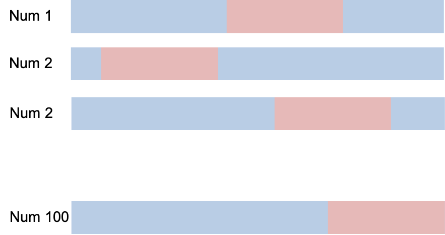
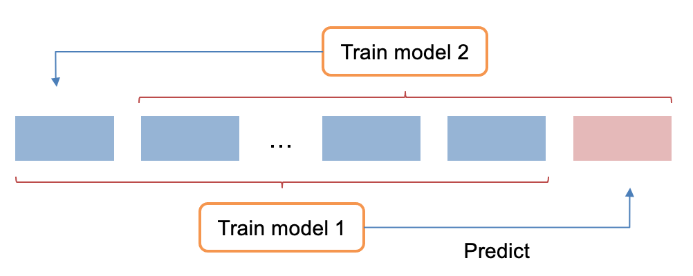

.. _post-model_assess:

==================================
Model Assessment: Cross Validation
==================================

Overview
========

Khi xây dựng mô hình, để tránh hiện tượng overfitting, dữ liệu thường được chia làm hai phần. Phần train dùng để ước lượng tham số mô hình. Phần validate dùng để kiểm tra tính hiệu quả của mô hình vừa được ước lượng. Tuy nhiên nếu số lượng quan sát trong dữ liệu quá ít thì 70% dữ liệu là không đủ để xây dựng mô hình. Khi đó, mô hình sẽ được xây với 100% số lượng quan sát và không có dữ liệu validate. Đối với trường hợp này ta thường sử dụng hai cách:

- Cross Validation
- K-fold Validation

Cross Validation
----------------
Cross validation  được thực hiện theo các bước như sau:

- Bước 1. Chia ngẫu nhiên mẫu thành 70\% cho train và 30\% cho validate.	
- Bước 2. Hồi quy mô hình với mẫu train và đánh giá mô hình với mẫu validate.
- Bước 3. Lặp lại các bước 1 và bước 2 1000 lần.
- Bước 4. Tính trung bình 1000 chỉ số thống kê của từng mẫu.

Minh hoạ kỹ thuật Cross validation
được cho như sau:

K-fold Validation
-----------------

K-fold Validation được thực hiện theo các bước như sau:

- Bước 1. Chia dữ liệu đã cho thành :math:`k` phần (:math:`k-fold`).
- Bước 2. Dùng :math:`k-1` fold để train model và dùng 1 fold còn lại để validate. Lúc này fold còn lại sẽ có predicted.
- Bước 3. Lặp lại bước 2 tới :math:`k` lần. Sau bước này tất cả :math:`k` fold đều có predicted.
- Bước 4. Tính các chỉ số đánh giá mô hình trên dựa trên predicted.

Minh hoạ kỹ thuật K-fold Validation được cho như sau:

Sử dụng Macro
=============
Syntax
------
Cú pháp của macro cross validation như sau:

.. code:: sh

  %MODEL_CROSS_VALIDATION (DATA, NUM, PERCENT, WOE_VARLIST, TYPE);

Trong đó:

- **DATA (data)**: Dữ liệu xây dựng mô hình. Dữ liệu cần chứa ít nhất biến BAD và các biến trong **WOE_VARLIST**.
- **NUM (integer)**: Số lượng các bước lặp lại.
- **PERCENT (float [0-1])**(mặc định 0.3): Tỉ lệ chia dữ liệu validate/ train: x:(1-x).
- **WOE_VARLIST** (WOE variable list): Danh sách biến hồi quy mô hình (dạng WOE).
- **TYPE** (mặc định 2): Nếu Type=1 thì macro sẽ không tính lại WOE của các biến. Khi đó macro sẽ chạy nhanh hơn. Nếu Type=2 thì macro sẽ tính lại WOE của các biến trước khi hồi quy.

Chi tiết
--------

Kết quả
-------

Ví dụ
-----

Ví dụ chạy macro cross validation như sau:

.. code:: sh

   %MODEL_CROSS_VALIDATION(DATA=DATA.TRAIN_WOE, 
	NUM=100, 
	PERCENT=0.3, 
	WOE_VARLIST=X1 X2 X3 X4 X5 X6 X7 X8 X9 X10, 
	TYPE=2);
