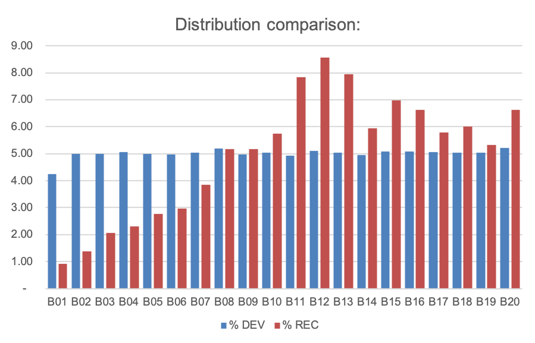
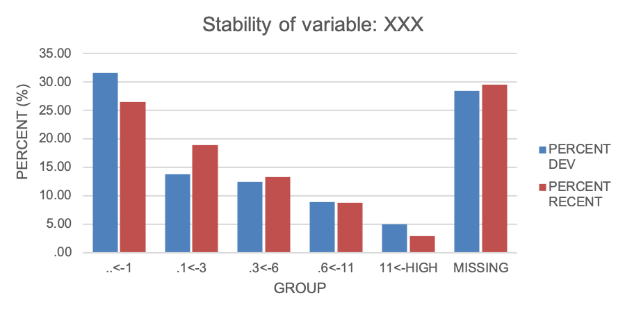
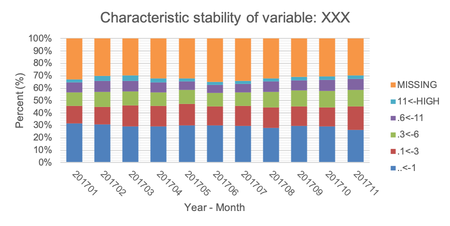

.. _post-moni-stability:

============================
Monitoring Report: Stability
============================

Đánh giá sự ổn định được chia thành hai loại: Đánh giá trên toàn dữ liệu và đánh giá theo từng biến.

Đánh giá sự ổn định trên toàn bộ dữ liệu
========================================

Ý nghĩa sự ổn định của toàn dữ liệu:

-	Đánh giá sự ổn định của mô hình nhằm mục đích đảm bảo tương lai sẽ giống với quá khứ.
-	Đánh giá độ ổn định nhằm đảm bảo các chỉ số cut-off vẫn giữa nguyên ý nghĩa với mẫu development.
-	Đánh giá sự ổn định của từng biến để lựa chọn biến.

Để đánh giá sự ổn định ta cần dữ liệu train và out of time. Sau khi xây dựng xong mô hình, ta sẽ tiến hành chấm điểm cho hai dữ liệu này. Sau khi có điểm, ta chia điểm chấm này thành 20 khoảng vào tính số lượng và phần trăm quan sát trong mỗi khoảng. Hình sau đây minh họa sự so sánh phân phối giữa dữ liệu train và out of time:

Trong đó :math:`\%Dev,\%Rec` là phần trăm quan sát trong mỗi khoảng của mẫu train (DEV-development) và out of time (REC- recent).

Để có một đánh giá định lượng, ta sử dụng chỉ số PSI (population stability index)

.. math::
  PSI=\sum_{i=1}^n\left(\%Dev_i-\%Rec_i\right)\times \ln\left(\frac{\%Dev_i}{\%Rec_i}\right)
  
Trong đó:

- :math:`\%Rec_i`: Tỉ lệ quan sát ở khoảng thứ i so với toàn mẫu ở mẫu kiểm định (out of time).
- :math:`\%Dev_i`: Tỉ lệ quan sát ở khoảng thứ i so với toàn mẫu ở mẫu phát triển (train).

Thang đánh giá cho chỉ số PSI được cho dưới đây:

- :math:`PSI \le 10`: Mô hình là ổn định.
- :math:`10 \le PSI \le 20`: Mô hình tương đối ổn định.
- :math:`20 < PSI`: Mô hình không ổn định.

Đánh giá sự ổn định của từng biến
=================================

Ý nghĩa sự ổn định của từng biến:

- Tìm ra nguyên nhân mất ổn định của mô hình.
- Đánh giá sự biến động của mỗi biến qua thời gian.
- Tìm ra các sai sót trong hệ thống.

Để đánh giá sự ổn định cho từng biến, ta thực hiện tương tự đánh giá sự ổn định cho toàn mẫu. Hình sau đây minh hoạ so sánh phân phối giữa mẫu development và recent:

Chỉ số sử dụng là CSI (characteristic stability index). 

.. math::
  CSI=\sum_{i=1}^n\left(\%Dev_i-\%Rec_i\right)\times \ln\left(\frac{\%Dev_i}{\%Rec_i}\right)
  
Trong đó:

- :math:`\%Rec_i`: Tỉ lệ quan sát ở nhóm thứ i so với toàn mẫu ở mẫu kiểm định (out of time).
- :math:`\%Dev_i`: Tỉ lệ quan sát ở nhóm thứ i so với toàn mẫu ở mẫu phát triển (train).

Ngoài ra, ta có thế đánh giá sự ổn định của biến qua một thời gian dài bằng cách quan sát đồ thị phân phối biến.  Ví dụ như sau:

Từ đồ thị ta có thể thấy được:

- Xu hướng dịch chuyển giữa các nhóm biến.
- Phát hiện các sai sót trong dữ liệu.

Sử dụng Macro
=============

Syntax
------

Cú pháp chạy macro để output ra báo cáo ổn định của mô hình như sau:

.. code-block:: sas
  %LET DATA=
  %LET PARAM=
  %LET VARLIST=	
  %LET DEVDAY=
  PROC FORMAT;
	/* SCORE */
	  VALUE SCOREF 
  RUN;
  %MONI_STABILITY;

Trong đó:

-	**DATA (data)**: Dữ liệu để kiểm định cần chứa tất cả các thông tin như sau:
    -	Dữ liệu bao gồm thông tin train và outtime. Phân biệt bởi biến **YEARMONTH** có định dạng YYYYMM.
    -	Dữ liệu phải chứa các biến trong **VARLIST** dưới dạng WOE_ và GRP_. Ví dụ **VARLIST=X1 X2** thì dữ liệu phải chứa **WOE_X1 WOE_X2 GRP_X1 GRP_X2**
    -	**SCORE** là output từ mô hình.
-	**PARAM (data)**: Dữ liệu chứa hệ số ước lượng của các biến. Là output từ proc logistic. Cần chứa đầy đủ các biến trong VARLIST.
-	**VARLIST (variable list)**: Các biến này sẽ được đưa vào báo cáo tính ổn định.
-	**FORMAT (proc format)**: Các điểm cắt của SCORE được lưu dưới dạng PROC FORMAT.
-	**DEVDAY(YYYYMM)**: thể hiện cách phân tách dữ liệu train và outtime. Macro hiểu rằng nếu YEARMONTH <= DEVDAY thì dữ liệu và Development, còn lại là out of time.

Detail
------

Kết quả
-------

Ví dụ
-----

**Ví dụ 1:** Chạy báo cáo monitoring với dữ liệu *DATA.ALL* bao gồm cả train và out of time. Các biến thuộc mô hình *X1 X2 X3 X4 X5 X6 X7 X8 X9 10*.

.. code:: sh  

  %LET DATA= DATA.ALL;
  %LET PARAM= DATA.TRAIN_PARAM;
  %LET VARLIST=	X1 X2 X3 X4 X5 X6 X7 X8 X9 10;
  %LET DEVDAY=201703;

  PROC FORMAT;
    /* SCORE */
    VALUE SCOREF 
      -9999997< - 0.022 = '.< - 0.022' 
      0.022< - 0.028 = '0.022< - 0.028' 
      0.028< - 0.035 = '0.028< - 0.035' 
      0.035< - 0.043 = '0.035< - 0.043' 
      0.043< - 0.051 = '0.043< - 0.051' 
      0.051< - 0.06 = '0.051< - 0.06' 
      0.06< - 0.071 = '0.06< - 0.071' 
      0.071< - 0.086 = '0.071< - 0.086' 
      0.086< - 0.102 = '0.086< - 0.102' 
      0.102< - 0.122 = '0.102< - 0.122' 
      0.122< - 0.143 = '0.122< - 0.143' 
      0.143< - 0.178 = '0.143< - 0.178' 
      0.178< - 0.251 = '0.178< - 0.251' 
      0.251< - HIGH = '0.251< - HIGH';
  RUN;

  %MONITORINGX;
  

