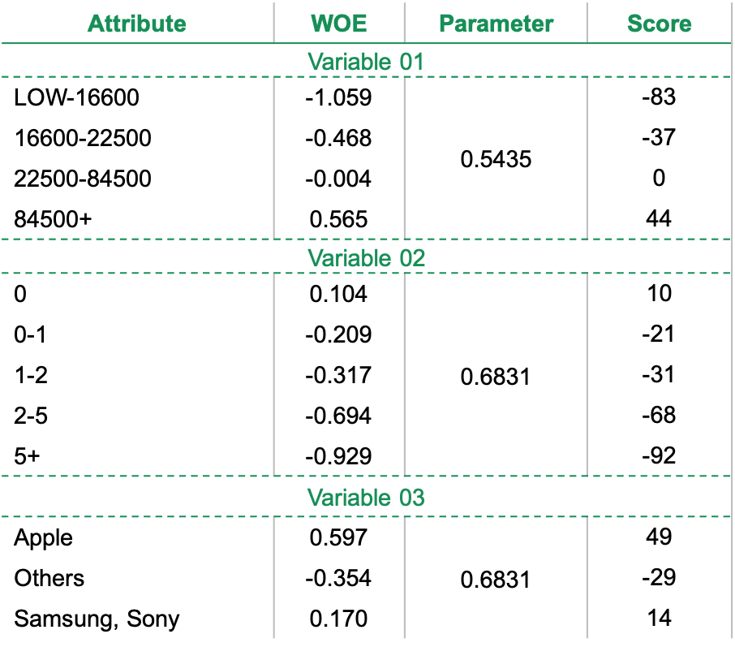

.. _post-report_scorecard:

================
Report Scorecard
================

Overview
========

Nguyên nhân
-----------

- Công thức của logistic đôi khi không thể implement trên các hệ thống do các hệ thống thiếu function.
- Mô hình cần đưa ra kết quả đơn giản để đơn vị kinh doanh có thể hiểu được.
- Với mô hình xếp hạng thì output không nhất thiết phải là xác suất mà chỉ cần thể hiện khách hàng A là tốt hơn hay xấu hơn khách hàng B.
- Cần đưa ra kết quả để có thể hiểu được nhóm nào của biến nào ảnh hưởng lớn nhất đến điểm của khách hàng

Lý thuyết
---------

Vì :math:`f(t)=\frac{1}{1+exp⁡(-t)}` là hàm đồng biến nên:

.. math::
  f(t_A)>f(t_B) \Leftrightarrow t_A>t_B.

Trong đó 

.. math::
  t &=ln⁡(odd)\\
    &=\beta_0+\beta_1 woe_{x_1}+\beta_2 woe_{x_2}+\cdots+\beta_n woe_{x_n}
  
Do đó, để xếp hạng khách hàng thì chỉ cần dùng :math:`ln⁡(odd)`. Cách thức biến đổi như sau:

.. math::
  Score &=Offset+Factor\times ln(odds)\\
        &=Offset+Factor\times\left(\beta_0+\sum_{i=1}^n \beta_i woe_{x_i}\right)\\
        &=\sum_{i=1}^n \left(\frac{Offset}{n}+Factor\times \left(\frac{\beta_0}{n}+\beta_i woe_{x_i}\right)\right)
        
Điểm của nhóm :math:`j` của biến :math:`x_i` sẽ là:

.. math::
  \frac{Offset}{n}+Factor\times \left(\frac{\beta_0}{n}+\beta_i woe_{x_i}\right)

Chú ý: 

- Với ngân hàng  thì Offset=383 và Factor=144.27
- Để cho đơn giản khi tính toán, có thể tách riêng Intercept(:math:`\beta_0`).

Final Scorecard Report
----------------------

Final Scorecard Report được cho trong ví dụ dưới đây

   
Trong bảng bên, Score được tính theo công thức

.. math::
  Score=WOE\times Param\times Factor
Trong đó Factor=144.27. Intercept được đặt riêng và tính bằng công thức:

.. math::
  Intercept=Offset+Factor\times \beta_0
Trong đó Offset=383 

Từ scoredcard cuối cùng cần chú ý các vấn đề như sau:

- Các nhóm của biến cộng điểm và trừ điểm nhiều nhất cho khách hàng. Từ đó đánh giá tác động của biến đến mô hình.
- Kiểm tra logic giữa điểm và badrate. Điểm càng cao thì bad rate trong nhóm phải càng thấp.
- Có thể chuyển score của các nhóm thành các giá trị lớn hơn 0 (bằng cách cộng tất cả với giá trị nhỏ nhất) để tiện so sánh trọng số.
