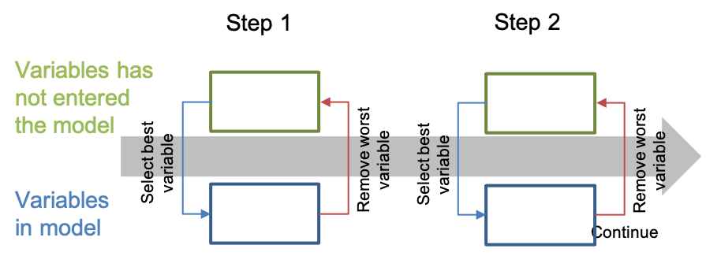

.. _post-select_foward:

====================================
Variable Selection: Foward Selection
====================================

Variable Selection
==================

Phương pháp lựa chọn biến bằng phương pháp Foward thuộc dạng thuật toán Greedy. 
Các phương pháp
===============
Các phương pháp chọn biến thường được dùng là Forward, Backward và Stepwise

Phương pháp forward
-------------------

Phương pháp forward được mô tả như sau:

-	Bước 0: Bắt đầu với mô hình có 0 biến. Chọn biến sao cho mô hình mạnh nhất (hệ số Gini là cao nhất). Đưa biến đó vào tập hợp biến đã vào mô hình.
-	Bước 1. Chọn biến từ tập hợp các biến chưa vào mô hình sao cho biến đó kết hợp với tập hợp biến đã vào mô hình để mô hình mạnh nhất. Thêm biến đó vào danh sách biến đã vào mô hình.
-	Bước 2. Tiếp tục các bước 1 cho đến khi việc thêm biến không ảnh hưởng khác biệt đến sức mạnh của mô hình
Minh họa cho phương pháp forward được cho như sau:

Phương pháp backward
--------------------

Phương pháp backward ngược lại với forward. Bắt đầu với việc cho tất cả các biến vào mô hình và loại dần các biến sao cho mô hình bị yếu đi ít nhất

Phương pháp stepwise
--------------------

Phương pháp stepwise là kết hợp của forward và backward. Các bước thực hiện được mô tả như sau:

-	Bước 0: Bắt đầu với mô hình có 0 biến. Chọn biến sao cho mô hình mạnh nhất. Đưa biến đó vào tập hợp biến đã vào mô hình
-	Bước 1.1. Chọn biến từ tập hợp các biến chưa vào mô hình sao cho biến đó kết hợp với tập hợp biến đã vào mô hình để mô hình mạnh nhất. Thêm biến đó vào danh sách biến đã vào mô hình.
-	Bước 1.2. Chọn biến từ tập hợp biến đã vào mô hình sao cho khi loại biến đó đi thì mô hình yếu đi ít nhất. Thêm biến đó vào tập hợp biến chưa vào mô hình.
-	Bước 2. Tiếp tục các bước 1.1 và 1.2 cho đến khi việc thêm biến/bỏ biến không ảnh hưởng khác biệt đến sức mạnh của mô hình

Minh họa cho phương pháp stepwise được cho như sau:

    
    
Một số điều chỉnh
-----------------

Các thuật toán trên đều được tích hợp sẵn trong các chương trình `PROC LOGISTIC <https://documentation.sas.com/?docsetId=statug&docsetTarget=statug_logistic_syntax01.htm&docsetVersion=15.1&locale=en>`_ và `PROC HPLOGISTIC <https://documentation.sas.com/?docsetId=statug&docsetTarget=statug_hplogistic_syntax01.htm&docsetVersion=14.3&locale=en>`_. Tuy nhiên, các chương trình này sử dụng p-value để chọn biến tại mỗi bước. Macro SelectForward được thiết kể để chọn biến tại mỗi bước theo hệ số Gini.
