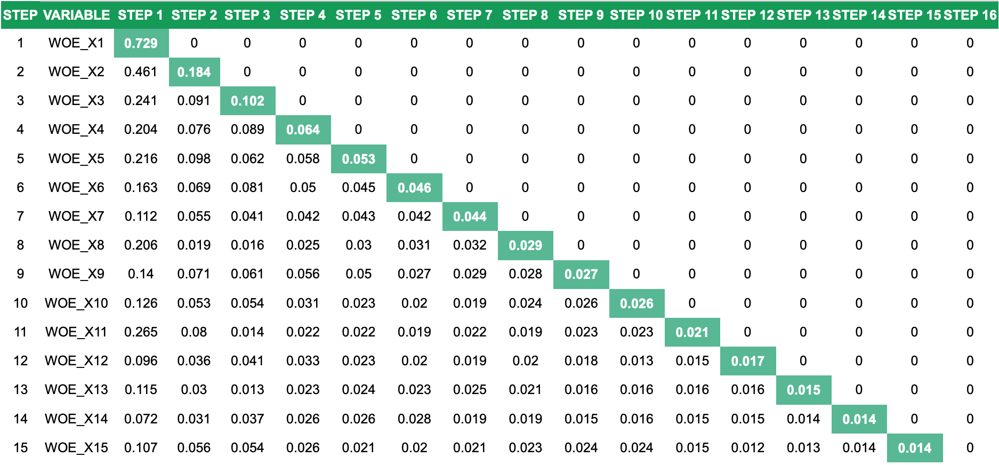

.. _post-select_mariv:

=========================================
Variable Selection: Marginal IV Selection
=========================================

Marginal IV
===========
Ta định nghĩa mô hình :math:`M_k` với kết quả đầu ra: :math:`P(Good)_i=(y_{k,i})`. Xét biến X được chia thành các nhóm :math:`1,2,…,n`. Với mỗi nhóm, ta định nghĩa :math:`\Delta WoE` như sau:

.. math::
    \Delta WoE=WoE_{obs}-WoE_{exp}=\ln\left(\frac{G_{obs}/TotalG_{obs}}{B_{obs}/TotalB_{obs}}\right)-\ln\left(\frac{G_{exp}/TotalG_{exp}}{B_{exp}/TotalB_{exp}}\right)

Trong đó:

- :math:`G_{obs},B_{obs}` là số lượng quan sát good, số lượng quan sát bad trong nhóm.
- :math:`G_{exp},B_{exp}` là tổng xác xuất dự báo good, tổng xác suất dự báo bad trong nhóm.

Công thức tính Marginal IV của biến được cho như sau:

.. math::
    MIV=\sum_{i=1}^n \left(\%G_{obs}-\%B_{obs} \right)\times \Delta WoE.
	
Minh họa công thức tính được cho trong bảng dưới đây:

.. list-table:: Example of Marginal IV Calculation
   :widths: 10 15 15 15 15 15 15 20 20
   :header-rows: 1
   
   * - Nhóm
     - Good (obs)
     - Bad (obs)
     - WoE (obs)
     - Good (exp)
     - Bad (exp)
     - WoE (exp)
     - Delta WoE
     - Marginal IV
   * - 1
     - 2,785	
     - 902
     - -0.853
     - 3,240
     - 447
     - 0	
     - -0.853
     - 0.067
   * - 2	
     - 8,053	
     - 1,881
     - -0.526
     - 8,729
     - 1,205
     - 0
     - -0.526
     - 0.062
   * - 3
     - 6,820
     - 1,028
     - -0.088
     - 6,896
     - 952
     - 0
     - -0.088
     - 0.001
   * - 4
     - 29,726
     - 2,732
     - 0.407
     - 28,521
     - 3,937
     - 0
     - 0.407
     - 0.085
   * - Tổng
     - 47,384
     - 6,543
     - 
     - 47,386
     - 6,541
     - 
     - 
     - 0.216     
Lưu ý rằng, với model chỉ có intercept thì công thức Marginal IV cho kết quả trùng với IV.

Thuật toán lựa chọn biến dựa trên MIV
=====================================

Dựa trên khái niệm Marginal IV, thuật toán chọn biến dựa trên Marginal IV được đề xuất như sau:

#. Xếp các biến theo thứ tự marginal IV giảm dần.
#. Chọn biến có Marginal IV lớn nhất vào mô hình và ước tính hệ số. Từ đó tính ra các kết quả dự báo của mô hình.
#. Tính lại Marginal IV của các biến (chú ý rằng, Marginal IV của biến đã vào mô hình bằng 0).
#. Tiếp tục các bước từ 1 đến 3 cho đến khi không còn biến nào có Marginal IV đủ lớn (có thể chọn điểm cắt MIV>0.01)

Minh họa cho kết quả chọn biến sử dụng Marginal IV được cho trong bảng dưới đây:

