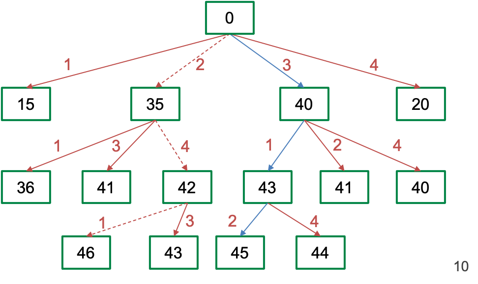

.. _post-select_overview:

==================
Variable Selection
==================

Tổng quan
=========

Việc lựa chọn biến ở mô hình Credit Scoring có mục đích chọn số biến ít nhất sao cho mô hình là mạnh nhất. Việc lựa chọn biến cho mô hình cần thoả mãn tiêu chí định tính và định lượng.

**Tiêu chí định tính** thường bao gồm các tiêu chí như sau:

- Chất lượng biến, khả năng sẵn có của biến,
- Độ đa dạng của các biến,
- Sự ổn định của biến trong tương lai,
- Ý kiến chuyên gia, 
- …
Vì các tiêu chí định tính rất đa dạng và mỗi tổ chức có đặc trưng riêng về khẩu vị rủi ro, nguồn dữ liệu nên trong tài liệu giả định các biến đã được lọc qua các tiêu chí định tính này này.

**Tiêu chí định lượng** bao gồm các tiêu chí như sau:

- Các biến không có tương quan đôi một lớn hơn 0.7: Thật ra điều này không hề có trong bất kỳ tài liệu chính thống nào. Nhiều nghiên cứu chỉ ra rằng với số lượng mẫu đủ lớn thì sự đa cộng tuyến giữa các biến không ảnh hưởng tới kết quả hồi quy mô hình. Ngưỡng 0.7 là tự quy định.
- Các hệ số phải là dương: Từ công thức tính :math:`WoE=\ln\left(\frac{\%Good}{\%Bad}\right)` ta thấy rằng, khách hàng càng tốt thì WoE càng lớn. Điều đó nghĩa là các hệ số hồi quy :math:`\beta_1, \beta_2, \ldots, \beta_n` ứng với :math:`woeX1,woeX2,\ldots,woeXn` phải là các giá trị dương. 
- P-value của mỗi biến phải nhỏ hơn 0.05: Điều này để đảm bảo biến vào mô hình là có ý nghĩa. Tuy nhiên chỉ số này không đáng tin cậy và có thể fake dễ dàng.
- Tối đa hóa sức mạnh của mô hình: Các tài liệu và các tổ chức tín dụng hay sử dụng chỉ số Gini (một số dạng khác là AR, AUC) để đánh giá sức mạnh của mô hình.

Lựa chọn biến là công việc chọn ra :math:`k` biến từ :math:`n` biến ban đầu sao cho thoả mãn các tiêu chí đã đặt ra. Các phương pháp lựa chọn biến được liệt kê ở mục tiếp theo.

Phương pháp lựa chọn biến
=========================

Phương pháp lựa chọn biến thường được chia ra thành ba loại là thử các trường hợp, thuật toán Greedy và LASSO.

Thử tất các các trường hợp
--------------------------
Thuật toán best-subset thử tất cả các tổ hợp biến để tìm ra bộ biến tốt nhất. Với p biến thì có tất cả :math:`2^n-1 `tổ hợp biến. Con số :math:`2^n-1` tăng rất nhanh khi :math:`n` tăng lên. Trong mô hình Credit Scoring, danh sách  ban đầu thường có nhiều hơn 50 biến nên số trường hợp cần thử lên đến hàng ngìn tỷ. Thử hết các trường hợp này là bất khả thi. Một số thuật toán đã được đề xuất để giảm số lượng trường hợp cần thử. Một trong số đó là branch & bound. Tuy nhiên phương pháp này có các nhược điểm như sau:
	
- Số lượng các trường hợp cần thử vẫn rất lớn.
- Kết quả tìm ra là tối ưu nhưng có thể vẫn không đảm bảo điều kiện về dấu và sự tương quan giữa các biến.
- Phương pháp branch & bound dựa trên giả định hàm mất mát là monotonic. Tuy nhiên, các mô hình thẻ điểm tín dụng thường chọn mô hình dựa trên hệ số Gini. Hệ số này là rời rạc và không có tính chất đơn điệu.

Vì các lý do này, phương pháp best subset không phù hợp với đa phần các mô hình thẻ điểm tín dụng. Phương pháp này chỉ có thể áp dụng nếu số lượng biến trong mô hình là nhỏ trong khả năng chạy của máy tính.

Thuật toán Greedy
-----------------
Thuật toán Greedy là thuật toán tìm kiếm sự tối ưu trong từng bước. Từ đó kỳ vọng rằng kết quả tổng thể cũng là tối ưu. Đối với bài toán lựa chọn :math:`k` biến từ :math:`n` biến, thuật toán sẽ diễn ra từng bước. Mỗi bước sẽ cố gắng chọn biến sao cho hiệu suất của mô hình tại bước đó là tốt nhất. Một số phương pháp phổ biến nhất ở dạng này là:

- Forward, Backward, Stepwise.
- Marginal IV.

Trong đó phương pháp stepwise được sử dụng phổ biến nhất. Thuật toán Greedy cần khối lượng tính toán thấp O(p^2) với p là số lượng biến trong mô hình. Tuy nhiên thuật toán này có nhược điểm như sau:

- Bộ biến cuối cùng không đảm bảo là bộ biến tốt nhất.
- Không kiểm soát được các hệ số ước tính là số âm.

Hình sau đây minh hoạ nhược điểm của thuật toán Greedy khi mô hình tối ưu lại từng bước nhưng không tối ưu tổng thể:

Phương pháp phạt
----------------

Nhắc lại lý thuyết, mô hình hồi quy logistic ước lượng các tham số thông qua cực tiểu hàm log-likelihood. 

.. math::
    L(\beta)=-2LL=-2\sum_{i=1}^n \left(y_i\log⁡(\widehat{y_i})+(1-y_i)\log⁡(1-\widehat{y_i})\right) 

Các phương pháp “phạt” cộng thêm một phần phạt vào hàm mất mát L(b). Một số cách tiếp cận phần phạt như sau:

**Phương pháp LASSO** (least absolute shrinkage and selection operator) thêm phần phạt là tổng giá trị tuyệt đối của các hệ số. Công thức hàm mất mát mới như sau:

.. math::
    L_1(b)=-2LL(\beta)+\lambda \sum_{j=1}^n |\beta_i| 
Trong đó:

- :math:`n` là số lượng các hệ số trong mô hình.
- :math:`\lambda` là regularization penalty. Khi :math:`\lambda=0` thì không có phần phạt. Khi :math:`\lambda` càng lớn thì phần "phạt" càng mạnh.

**Phương pháp ridge** thêm phần phạt là tổng bình phương các hệ số. Công thức hàm mất mát mới như sau:

.. math::
    L_1(b)=-2LL(\beta)+\lambda \sum_{j=1}^n \beta_i^2 
    
Vấn đề quan trọng trong phương pháp Rigge và LASSO là tìm tham số :math:`\lambda`. Chương trình thống kê SAS thực hiện việc này như sau:

- Với bước thứ :math:`k`, lấy :math:`\lambda=\rho^k` (giá trị mặc định của :math:`\rho=0.8`).
- Tính toán hệ số dựa trên hàm mất mát với :math:`\lambda`
- Tính toán tiêu chí lựa chọn mô hình (ví dụ BIC, AIC, …).
- Dừng thuật toán nếu hàm mất mát tăng lên từ bước :math:`i` đến :math:`i+1`.

    
