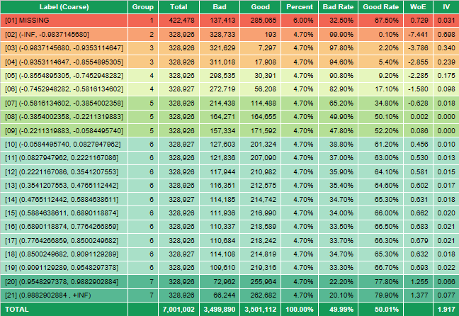
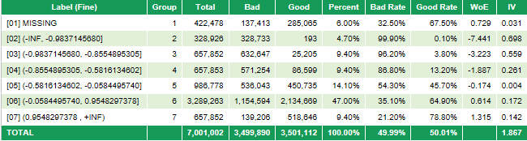
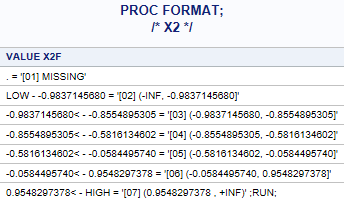
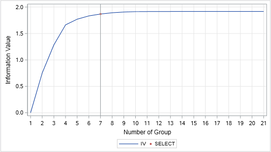

.. _post-variable_analysis:

=================
Variable Analysis
=================

Khi xây dựng mô hình nói chung, ta thường gặp các vấn đề phổ biến:

-	Các giá trị missing: Mô hình hồi quy bỏ qua các giá trị missing.
-	Các giá trị outlier: Các giá trị outlier sẽ khiến cho kết quả ước lượng bị lệch.
-	Các biến chữ: Các biến chữ cần có phương pháp biến đổi đặc biệt trước khi hồi quy (cách phổ biến nhất là dummy transformation).

Phương pháp phổ biến để khác phục các vấn đề này là binning và transform các biến thành dạng WOE. 

Binning và transform WOE
========================

Để xử lý vấn đề nói trên, các biến sẽ được chia thành từng khoảng (binning) và mỗi khoảng sẽ được gán cho một giá trị thay thế (WoE). Phương pháp binning được mô tả như sau:

- Là việc rời rạc hóa một biến bằng cách chia biến thành các nhóm mà các quan sát trong nhóm có đặc tính giống nhau. 
-	Mỗi nhóm được gán một giá trị thay thế cho cả nhóm.
-	Khi hồi quy mô hình, sẽ thực hiện hồi quy giữa target và các giá trị đại diện mới.

Ưu điểm của phương pháp binning:

-	Cách đơn giản để xử lý missing, outlier và các biến rời rạc.
-	Tăng tính chính xác trong dự đoán.
-	Có cái nhìn tổng quan về xu hướng biến trong dữ liệu.

Giá trị thay thế cho mỗi nhóm là WOE (Weight of Evidence) được tính theo công thức:

.. math::
  WoE_i=\ln\left(\frac{g_i/G}{b_i/B}\right).

Trong đó:

-	:math:`g_i,b_i` là số lượng good và bad trong nhóm :math:`i`.
-	:math:`G,B` là tổng số lượng good và bad trong dữ liệu.

Biến đổi WOE có các lợi thế như sau:

-	Chuẩn hóa giá trị của các biến.
-	Giảm thiểu lỗi khi tính toán với số mũ.
-	Quan sát trực quan và rõ ràng mỗi liên hệ giữa biến dự đoán và biến target.
-	Tăng tính chính xác khi dự đoán. (với các biến có sự phụ thuộc không tuyến tính).
- Có thể điều chỉnh kết quả dựa trên hiểu biết về dữ liệu.

Bảng sau đây minh họa cho việc tính WoE:

.. list-table:: Example of WoE calculation
   :widths: 25 15 15 15 15
   :header-rows: 1
   :align: center
   
   * - Range
     - Total
     - Good
     - Bad
     - WoE
   * - Missing	
     - 1,422
     - 1,077
     - 345
     - -1.226
   * - (-∞;0.77M]	
     - 1,516
     - 1,124
     - 392
     - -1.311
   * - (0.77M;1.4M]	
     - 735
     - 641
     - 94
     - -0.445
   * - (1.4M;2.6M]	
     - 735	
     - 676	
     - 59
     - 0.074
   * - (2.6M;7.7M]	
     - 2,938
     - 2,793
     - 145
     - 0.593
   * - (7.7M;+∞)	
     - 7,347	
     - 7,120	
     - 227	
     - 1.081
   * - TOTAL	
     - 14,693	
     - 13,431	
     - 1,262
     - 

Lựa chọn biến ban đầu
=====================

Lựa chọn biến ban đầu là quy trình chọn các biến dựa trên tính dự báo đơn biến (phân biệt với lựa chọn biến khi vào mô hình – phân tích đa biến). Tính dự báo được đo lường bằng Information Value (IV). Công thức tính IV cho đơn biến được cho như sau:

.. math::
  IV=\sum_{i=1}^n\left(\%Good_i-\%Bad_i\right)\times \ln\left(\frac{\%Good_i}{\%Bad_i}\right)
  
Trong đó: :math:`\%Good_i=g_i/G` và :math:`\%Bad_i=b_i/B` với các định nghĩa tương tự như trong công thức WOE.  

Tính dự báo của biến (IV) được đánh giá bởi tiêu chí:

-	Nhỏ hơn 0.02: không có tính dự báo.
-	0.02 đến 0.1: Yếu.
-	0.1 đến 0.3: Trung bình.
-	0.3+: Mạnh.

Quy trình phân tích biến
========================

Quy trình phân tích biến được khuyến nghị theo các bước sau đây:

#. **Coarse Binning:** Chia biến thành 20 nhóm (tùy thuộc vào số lượng quan sát, có thể chia thành nhỏ hơn 20 nhóm).
#. Đảm bảo không có các nhóm 0 good hoặc 0 bad.
#. Vẽ đường WoE từ các nhóm (Coarse Bining)
#. Nhóm các nhóm nhỏ thành các nhóm lớn hơn theo các tiêu chí:
  - Các nhóm có WOE tương tự hoặc theo một xu hướng đã biết trước.
  - Số lượng các nhóm lớn từ 2-8 nhóm tùy vào độ dự báo của biến.
  - Số lượng quan sát ở mỗi nhóm không nhỏ quá 5% (có thể có ngoại lệ nếu là nhóm cực tốt hoặc cực xấu).
#. Lặp lại bước số 4 nếu kết quả nhận được chưa vừa ý.
#. Điều chỉnh WOE nếu có sample bias.
#. Kết qủa nhận được là **Fine Binning**.

Ví dụ về binning được cho như sau:

Coarse Binning

.. image:: ./images/VariableAnalysis/CoarseBinning.png
   :align: center
   :height: 226
   :alt: Coarse Binning

Fine Binning

.. image:: ./images/VariableAnalysis/FineBinning.png
   :align: center
   :height: 226
   :alt: Fine Binning

Sử dụng Macro Var_Bin
=====================

Syntax
------

Để tiến hành phân tích đơn biến, ta sử dụng Macro Var_Bin. Cú pháp của Macro như sau:

.. code:: sh
  
  %Var_Bin(Data=, Var=, Numbin=, Group=, Method=BESTIV, Cut_Raw=, Cut_Fine=, Round=4, Libname=WORK);
  
Trong đó:

- **Data (dataset)**  là dữ liệu đầu vào (dữ liệu train). Các tính toán trong quá trình phân tích biến sẽ được thực hiện trên dữ liệu này. Dữ liệu cần chứa ít nhất các biến Good, Bad và **Var**.
- **Var (variable)** là biến sẽ phân tích.
- **Numbin (int)** là số lượng nhóm được chia ban đầu bằng phương pháp quantile binning.
- **Group (int)** là số nhóm sau khi nhóm lại.
- **Cut_Raw (dataset)** là dữ liệu chứa có một biến UB chứa thông tin cận trên của điểm cắt. Ví dụ dữ liệu có các thông tin ., 1,4,6, . thì các điểm cắt sẽ là :math:`missing, (-\infty, 1], (1, 4], (4, 6], (6, +\infty)`. Nếu tham số này trống thì macro sẽ tự tìm các điểm cắt dựa trên **Var** và **Numbin**.
- **Cut_Fine**
- **Round (int)** (giá trị mặc định bằng 4) số lượng các chữ số sau dấu phảy ở các điểm cắt khi thực hiện quantile binning.
- **Libname (text)** (giá trị mặc định là WORK) thư viện lưu các kết quả output của macro bao gồm: VAR_BIN_RAW, VAR_BIN_FINE, VAR_BIN_MAPPING.
- **Method (character)** là các phương pháp nhóm biến. Các giá trị có thể được liệt kê như sau:

  - *BEST_IV*: Thử tất cả cách nhóm biến để tìm được cách nhóm thỏa mãn: 1) số lượng nhóm sau cùng là **Group** và 2) Information Value của cách nhóm là lớn nhất. Thời gian chạy macro với **numbin=25** là 13s (máy tính CPU i7-4790s, RAM 16GB, SSD) và tăng gấp đôi khi **numbin** tăng 1 đơn vị.
  - *MONO*: Thử tất cả cách nhóm biến để tìm được cách nhóm thỏa mãn: 1) số lượng nhóm sau cùng là **Group**, 2) Trend của WoE là monotonic (ngoại trừ nhóm missing) và 3) Information Value của cách nhóm là lớn nhất.
  -	*FAST*: Sử dụng thuật toán Greedy để giảm số lượng nhóm từ **numbin** xuống còn **group**. Thuật toán chạy nhanh nhưng không đảm bảo cách nhóm cuối cùng có IV lớn nhất.
  -	*BRANCH*: Thử tất cả các cách nhóm biến và sử dụng thuật toán Branch & Bound để nhóm biến. Sử dụng tham số này trong trường hợp NUM lớn (thường là lớn hơn 30). Thuật toán nhanh hơn BEST_IV.

Để điều chỉnh cách nhóm biến, ta sửa biến *GRP_FINAL* trong dữ liệu *FINALBIN** là kết quả đầu ra của macro Var_Bin. Các nhóm có giá trị *GRP_FINAL* bằng nhau được hiểu là thuộc cùng một nhóm lớn của Fine Binning. Sau đó, ta sử dụng macro Var_Bin_Manual

.. code:: sas
  
  %Var_Bin_Manual(Data=, Bin_raw=BIN_RAW, Bin_Fine=BIN_FINE);

Các tham số tương tự như macro Var_Bin. Macro Var_Bin_Manual chỉ chạy được **ngay sau khi** chạy macro Var_Bin. 

Detail
------

Output
------

Kết quả đầu ra của macro như sau:

Các kết quả output SAS
^^^^^^^^^^^^^^^^^^^^^^
.. _coarse_binning:
**Coarse Binning** bao gồm bảng và đồ thị. Bảng coarse binning chứa các thông tin như sau:

- *Label (Coarse)* chứa định danh nhóm (phần trong ngoặc vuông []) và khoảng giá trị của nhóm (nửa khoảng :math:`(a, b]`).
- *Group* Các nhóm có giá trị bằng nhau được hiểu là thuộc cùng một nhóm lớn của Fine Binning.
- *Total, Good, Bad* là số tổng số quan sát, tổng số quan sát good, tổng số quan sát bad trong nhóm.
- *Percent* tỉ lệ phần trăm số lượng quan sát của nhóm so với toàn bộ dữ liệu.
- *Bad Rate, Good Rate* là Bad/Total, Good/Total.
- *WoE, IV* được tính theo công thức ở trên.

Các màu trong bảng được tô dựa theo biến *Group*. Đồ thị coarse binning thể hiện số lượng quan sát trong mỗi nhóm và WOE tương ứng. Đồ thì được group theo biến *Group*.

**Fine Binning** tương tự như coarse binning.

**Format** có dạng PROC FORMAT, cần lưu lại format này để thực hiện bước tiếp theo là `Variable Transformation <https://smcs.readthedocs.io/vi/latest/post/VariableTransformation.html>`_.

.. _summary_iv:
**Information Value by Group Step** là đồ thị thể hiện giá trị IV với số lượng nhóm ở fine binning từ 1 đến **numbin**. Có thể dựa vào đồ thị này để quyết định **group**.

  
Các dữ liệu output
^^^^^^^^^^^^^^^^^^

**FINALBIN** là dữ liệu chứa thông tin coarse binning và fine binning của biến.

**SUMMARY_IV** là dữ liệu chứa thông tin IV tại mỗi bước của đồ thị :ref:`summary_iv`

**MAPPING** là kết quả nhóm tối ưu tại mỗi STEP.

**PRINT_RAW/ PRINT_FINE** là bảng dữ liệu của coarse binning và fine binning :ref:`coarse_binning`

**CUT_RAW/ CUT_FINE** là điểm cắt của coarse binning và fine binning.

**VAR_BIN_FINE/ VAR_BIN_COARSE** lưu trữ kết quả coarse binning và fine binning của **tất cả các biến đã phân tích**. Hai bảng này được sử dụng tại bước `Variable Report Binning <https://smcs.readthedocs.io/vi/latest/post/ReportVariable.html>`_.

**VAR_BIN_MAPPING** lưu kết quả nhóm biến dưới dạng proc format. Bảng này được sử dụng tại bước `Variable Transformation <https://smcs.readthedocs.io/vi/latest/post/VariableTransformation.html>`_.

Example
-------

Binning để tìm cách nhóm tối ưu:

.. code:: sh
  
  %VAR_BIN(DATA=DATA.TRAIN, VAR=X2, NUMBIN=20, GROUP=8);
  
Binning để tìm cách nhóm tối ưu và monotonic

.. code:: sh
  
  %VAR_BIN(DATA=DATA.TRAIN, VAR=X2, NUMBIN=20, METHOD=MONO);
  
Sử dụng Macro Var_Bin_manual
============================

Macro Var_Bin_manual được sử dụng ngay sau macro Var_Bin để điều chỉnh kết quả Fine binning trong trường hợp kết quả không như mong muốn. Cách sử dụng như sau:

