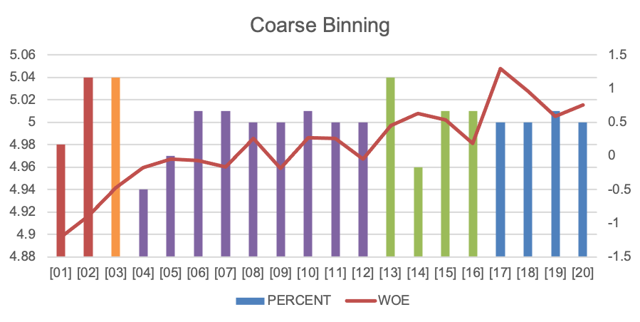

.. _post-variable_analysis:

=================
Variable Analysis
=================

Khi xây dựng mô hình nói chung, ta thường gặp các vấn đề phổ biến:

-	Các giá trị missing: Mô hình hồi quy bỏ qua các giá trị missing.
-	Các giá trị outlier: Các giá trị outlier sẽ khiến cho kết quả ước lượng bị lệch.
-	Các biến chữ: Các biến chữ cần có phương pháp biến đổi đặc biệt trước khi hồi quy (cách phổ biến nhất là dummy transformation).

Phương pháp phổ biến để khác phục các vấn đề này là binning và transform các biến thành dạng WOE. 

Binning và transform WOE
========================

Để xử lý vấn đề nói trên, các biến sẽ được chia thành từng khoảng (binning) và mỗi khoảng sẽ được gán cho một giá trị thay thế (WoE). Phương pháp binning được mô tả như sau:

- Là việc rời rạc hóa một biến bằng cách chia biến thành các nhóm mà các quan sát trong nhóm có đặc tính giống nhau. 
-	Mỗi nhóm được gán một giá trị thay thế cho cả nhóm.
-	Khi hồi quy mô hình, sẽ thực hiện hồi quy giữa target và các giá trị đại diện mới.

Ưu điểm của phương pháp binning:

-	Cách đơn giản để xử lý missing, outlier và các biến rời rạc.
-	Tăng tính chính xác trong dự đoán.
-	Có cái nhìn tổng quan về xu hướng biến trong dữ liệu.

Giá trị thay thế cho mỗi nhóm là WOE (Weight of Evidence) được tính theo công thức:

.. math::
  WoE_i=\ln\left(\frac{g_i/G}{b_i/B}\right).

Trong đó:

-	:math:`g_i,b_i` là số lượng good và bad trong nhóm :math:`i`.
-	:math:`G,B` là tổng số lượng good và bad trong dữ liệu.

Biến đổi WOE có các lợi thế như sau:

-	Chuẩn hóa giá trị của các biến.
-	Giảm thiểu lỗi khi tính toán với số mũ.
-	Quan sát trực quan và rõ ràng mỗi liên hệ giữa biến dự đoán và biến target.
-	Tăng tính chính xác khi dự đoán. (với các biến có sự phụ thuộc không tuyến tính).
- Có thể điều chỉnh kết quả dựa trên hiểu biết về dữ liệu.

Bảng sau đây minh họa cho việc tính WoE:

.. list-table:: Example of WoE calculation
   :widths: 25 15 15 15 15
   :header-rows: 1
   :align: center
   
   * - Range
     - Total
     - Good
     - Bad
     - WoE
   * - Missing	
     - 1,422
     - 1,077
     - 345
     - -1.226
   * - (-∞;0.77M]	
     - 1,516
     - 1,124
     - 392
     - -1.311
   * - (0.77M;1.4M]	
     - 735
     - 641
     - 94
     - -0.445
   * - (1.4M;2.6M]	
     - 735	
     - 676	
     - 59
     - 0.074
   * - (2.6M;7.7M]	
     - 2,938
     - 2,793
     - 145
     - 0.593
   * - (7.7M;+∞)	
     - 7,347	
     - 7,120	
     - 227	
     - 1.081
   * - TOTAL	
     - 14,693	
     - 13,431	
     - 1,262
     - 

Lựa chọn biến ban đầu
=====================

Lựa chọn biến ban đầu là quy trình chọn các biến dựa trên tính dự báo đơn biến (phân biệt với lựa chọn biến khi vào mô hình – phân tích đa biến). Tính dự báo được đo lường bằng Information Value (IV). Công thức tính IV cho đơn biến được cho như sau:

.. math::
  IV=\sum_{i=1}^n\left(\%Good_i-\%Bad_i\right)\times \ln\left(\frac{\%Good_i}{\%Bad_i}\right)
  
Trong đó: :math:`\%Good_i=g_i/G` và :math:`\%Bad_i=b_i/B` với các định nghĩa tương tự như trong công thức WOE.  

Tính dự báo của biến (IV) được đánh giá bởi tiêu chí:

-	Nhỏ hơn 0.02: không có tính dự báo.
-	0.02 đến 0.1: Yếu.
-	0.1 đến 0.3: Trung bình.
-	0.3+: Mạnh.

Quy trình phân tích biến
========================

Quy trình phân tích biến được khuyến nghị theo các bước sau đây:

#. **Coarse Binning:** Chia biến thành 20 nhóm (tùy thuộc vào số lượng quan sát, có thể chia thành nhỏ hơn 20 nhóm).
#. Đảm bảo không có các nhóm 0 good hoặc 0 bad.
#. Vẽ đường WoE từ các nhóm (Coarse Bining)
#. Nhóm các nhóm nhỏ thành các nhóm lớn hơn theo các tiêu chí:
  - Các nhóm có WOE tương tự hoặc theo một xu hướng đã biết trước.
  - Số lượng các nhóm lớn từ 2-8 nhóm tùy vào độ dự báo của biến.
  - Số lượng quan sát ở mỗi nhóm không nhỏ quá 5% (có thể có ngoại lệ nếu là nhóm cực tốt hoặc cực xấu).
#. Lặp lại bước số 4 nếu kết quả nhận được chưa vừa ý.
#. Điều chỉnh WOE nếu có sample bias.
#. Kết qủa nhận được là **Fine Binning**.

Ví dụ về binning được cho như sau:

Coarse Binning

.. image:: ./images/VariableAnalysis/FineBinning.png
   :align: center
   :height: 226
   :alt: Fine Binning

Fine Binning

Sử dụng Macro
=============
