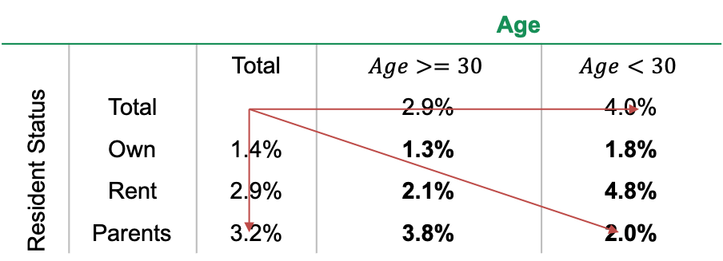

.. _post-variable_interaction:

====================
Variable Interaction
====================

Variable Interaction
====================

Variable interaction xảy ra khi:

- Xu hướng thực tế khác với xu hướng kết hợp của hai biến trong mô hình logistic.
- Không thể giải thích xu hướng của biến đơn trong mô hình.

**Ví dụ**: Xu hướng của hai biến Age và Resident status được cho như hình. Nếu mô hình hồi quy có hai biến trên thì kết quả đầu ra sẽ là (Age>=30, Resident Status=) tốt nhất và (Age<30, Resident Status=Parents) xấu nhất. Tuy nhiên dữ liệu thực tế không cho thấy nhận định trên.

Giải pháp là sẽ tạo một biến mới là kết hợp của hai biến ban đầu. Biến này sẽ được nhóm tương tự như phương pháp binning. Để phát hiện sự interactive giữa các biến, ta sử dụng các phương pháp sau:

- Dựa trên kinh nghiệm bản thân:
  - Đối với mô hình application, interaction thường xảy ra giữa các biến demographic
  - Đối với mô hình behavior, thường xảy ra interaction giữa biến behavior và biến month on book.
- Dựa trên interaction để giải thích chi tiết xu hướng của biến.
- Dựa trên decision tree và so sánh kết quả với hồi quy logistic.

Thực hiện variable interaction:

**Cách 1:**

- Nhóm từng biến theo format cho trước. 
- Lập bảng cross giữa hai biến là tính các chỉ số: số lượng, WOE, …
- Thực hiện nhóm tương tự như Binning.
- Tạo biến theo format của hai biến cũ.

**Cách 2:** Chạy mô hình decision tree với hai biến.
